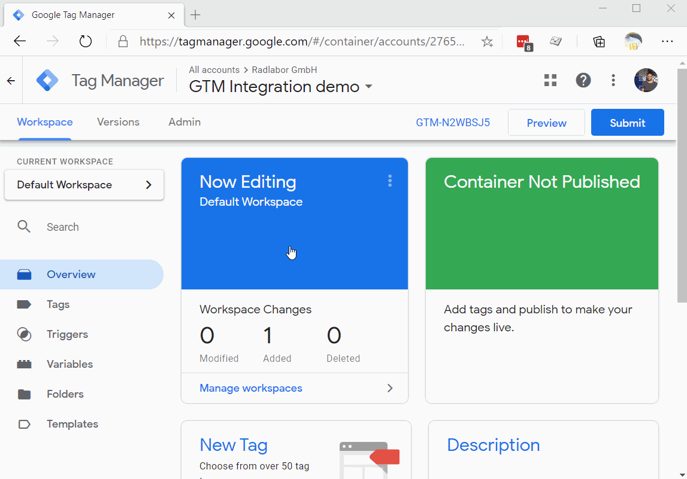

# Getting started with

To complete this guide the following **pre-requisites** are required.
1. Publishing privilege for GTM container.
2. Minimal knowledge of Javascript, HTML and CSS.
3. Access to HTML code of the page. To install the widget you will need to add "Fit the bike" with will open the Online Sizing widget. See [Gettting started](https://support.google.com/tagmanager/answer/6107163?hl=en&ref_topic=9001798) for guidance. If you do not have at access to the code of the page see Recipes section below.


## Customize integration script

Script template:

```
<script>
(function OZIntegration() {
    //Global configuration
    const OZ_CONFIG = {
        settings: {
            apiKey: 'YOUR_API_KEY_HERE',
            container: "oz-sizing-container",
            primary: 'hsl(187, 74%, 70%)',
            cta: 'rgb(150, 186, 50)',
        }
    };
    
    //Ensures that container element is present on the page, 
    //otherwise container is created and aded to the end of the page
    function ensureContainer(id: string){
        let container = document.getElementById(id);
        if(!container) {
            container = document.createElement('div');
            container.id, id;
            document.body.appendChild(container);
        }
        return container;
    }

    function loadScript(key: string, config: Object, src: string) {
        window['___OnlineSizing'] = key;
        window['___OnlineSizingConfig'] = config;
        const js = document.createElement('script') as HTMLScriptElement;
        js.id = key;
        js.src = src;
        js.async = true;

        const scripts = document.getElementsByTagName('script');
        const lastScript = scripts[scripts.length - 1];
        lastScript.parentNode.insertBefore(js, lastScript);
    };

    (function init(){
        ensureContainer(OZ_CONFIG.settings.container);
        loadScript('oz', OZ_CONFIG, 'https://staging-widgets.onlinesizing.bike/loader.js');
        console.log('all good');
    })();
})();
</script>
```
## Replace API key value

In the script above replace `YOUR_API_KEY_HERE` is Global configuration with your API key value. To get API key refer to [Obtain your API Key and whitelist domains](
https://docs.onlinesizing.bike/docs/getting-started/#step-1-obtain-your-api-key-and-whitelist-domains).


## Configure GTM container.

To install the widget you will need to add Custom HTML Tag and Window Loaded trigger.

1. Login to [Google Tag Manager](http://tagmanager.google.com/)
2. Go to **Triggers** section and press **New**. Under *Trigger Configuration* select Window Loaded. Give the trigger a name and press **Save**.

3. Now go to **Tags** section and press **New**. Under **Tag Configuration** select **Custom HTML** and under **Trigger Configuration* pick previously created trigger. Go back to Tag Configuration and paste customized integration script to HTML box.


To ensure that everything is working properly before publishing GTM container use GTM [Preview Mode](https://support.google.com/tagmanager/answer/6107056?hl=en#) to test the configuration in your browser.

After you ensure that everything works [Publish the configuration](https://support.google.com/tagmanager/answer/6107163?hl=en&ref_topic=9001798).

You can further configure when or if the widget will be loaded by fine-tuning trigger configuration, for example, limit loading of the widget only to product pages, or disable the loading conditionally if the user opted out from using functional cookies.

# GTM Recipes

## Limiting widget loading to product pages using trigger conditions.
TBD

## Disabling Online Sizing using trigger conditions.
*Scenario* In compliance with [EU GDPR](https://en.wikipedia.org/wiki/General_Data_Protection_Regulation) you offer site visitors to opt-out from certain optional functionality, for example, usage of javascript and cookies. This allows you to store a single cookie indicating the user's choice.

For demostration purposes imagine that you GDPR consent management systems sets `func_optout` as so: 

```
document.cookie = "func_optout=1; Max-Age=2600000; Secure; SameSite=Strict;"
```

Now lets update GTM configuration to obey user choice.

1. Login to GTM.
2. Go to **Variables** section. Under **User-Defined Variables** click **New** and click **Variable Configuration** block. Select **1st Party Cookie** from the list. In **Cookie name** specify `func_optout`. Rename the variable to "Opt-out Cookie" and click **Save**.

3. Go to **Tags** section and select **Online Sizing Widget Integration Trigger** we configured previously. Under **Trigger Configuration** change **All Window Loaded Events** option to **Some Window Loaded Events**. Select **Opt-out cookie** and change condition to **does not equil** and set value to `1`.
.
4. Save, Test and Publish the container.

## Adding the trigger button to the product page using GTM.
TBD

## 


## Side notes (draft bits and pieces)


Sucess of integration on the Online Sizing via GTM depends on the ability to add "Find my size" button and collect information about the bicycle from the page. Namely:

* `EAN/UPC product code`
* `Product name`
* `Product Image URL`


the trigger to limit the scope when the widget will be loaded to the page using Trigger Exceptions. Trigger Exceptions can be used to limit widget loading to `~/products/pages only 
See recipes sections for Example